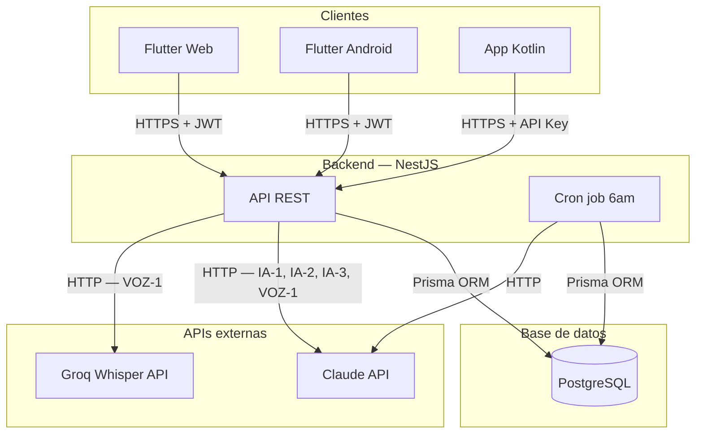
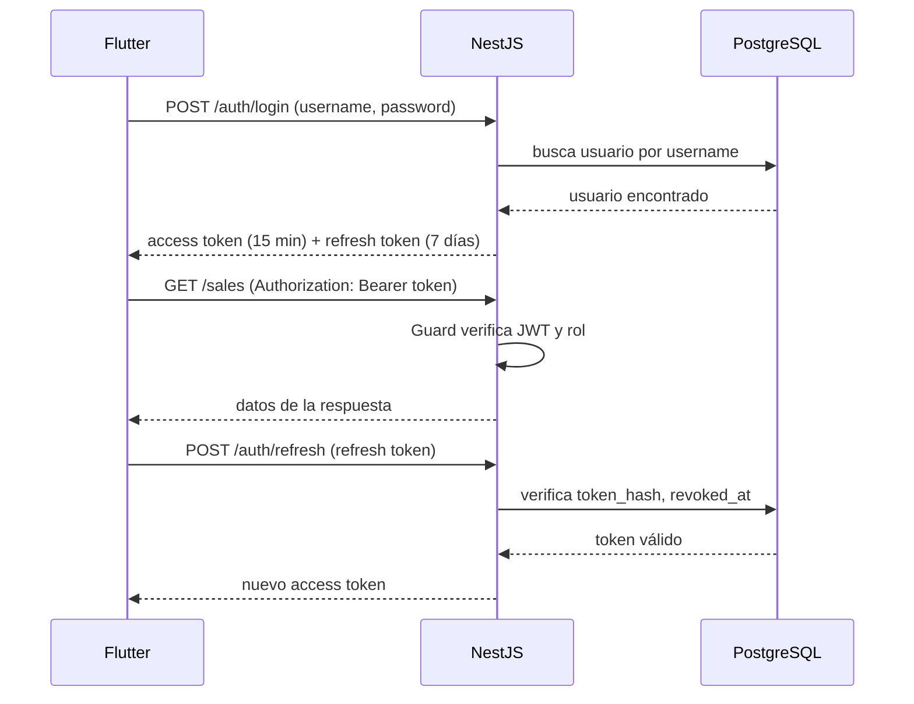
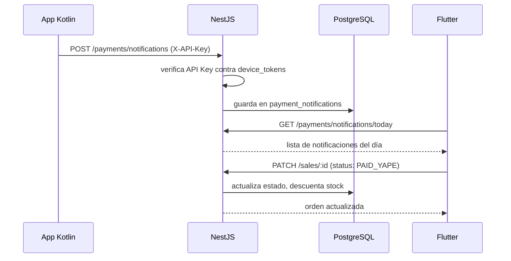
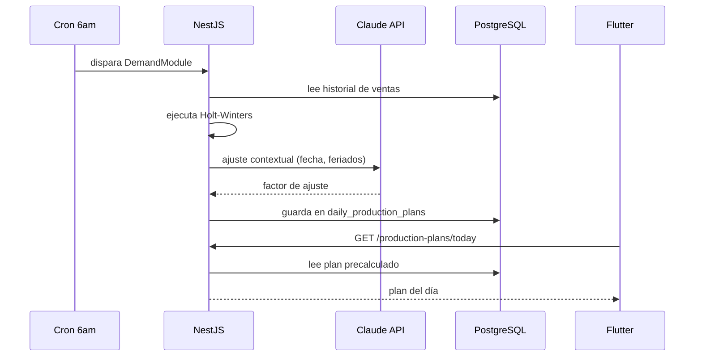

# Arquitectura del sistema

SmartBite es una aplicación multiplataforma con backend en NestJS, frontend
en Flutter y una app Android nativa en Kotlin para la integración de pagos.

---



---

## Visión general

El sistema tiene tres capas bien diferenciadas: clientes, backend y datos.
Los clientes Flutter se comunican con el backend via HTTPS con JWT. La app
Kotlin se comunica exclusivamente con el módulo de pagos usando una API Key.
El backend accede a PostgreSQL únicamente a través de Prisma ORM y se
comunica con Claude API y Groq Whisper para las funcionalidades de IA y voz.

---

## Capas del sistema

### Capa de clientes

**Flutter (web y Android)**
Un solo codebase que compila para web y Android. Es la interfaz principal
para todos los roles: dueño, cajero, mozo y cocinero. Se comunica con el
backend via HTTPS REST con JWT en el header `Authorization: Bearer`.

**App Kotlin (Android)**
APK independiente instalada en el celular del negocio. Corre en segundo
plano usando `NotificationListenerService` para interceptar notificaciones
de Yape, Plin y Ágora. Se autentica con el backend usando una API Key en
el header `X-API-Key`. No tiene interfaz propia salvo la pantalla de
registro inicial vía QR. Ver `docs/decisions/0003-kotlin-listener-over-third-party.md`.

---

### Capa de backend (NestJS)

Cada módulo encapsula su controlador, servicio y DTOs. Los Guards de NestJS
protegen cada endpoint verificando el JWT y el rol del usuario.

| Módulo                  | Responsabilidad                                  | Funcionalidades     |
| ----------------------- | ------------------------------------------------ | ------------------- |
| `AuthModule`            | Login, logout, refresh de tokens                 | AUTH-1              |
| `UsersModule`           | Gestión de cuentas y roles                       | AUTH-2              |
| `ProductsModule`        | CRUD de productos y precios                      | OPS-1               |
| `IngredientsModule`     | CRUD de insumos y stock                          | OPS-2               |
| `RecipesModule`         | CRUD de recetas por producto                     | OPS-3               |
| `SalesModule`           | Registro y cobro de órdenes, sale_items incluido | OPS-4, OPS-6, OPS-7 |
| `ExpensesModule`        | Registro de gastos y compras                     | OPS-5               |
| `CashClosesModule`      | Cierre de caja diario inmutable                  | REP-4               |
| `DashboardModule`       | Resumen en tiempo real del día                   | REP-1               |
| `ReportsModule`         | Reportes por período y rentabilidad              | REP-2, REP-3        |
| `AIModule`              | Asistente conversacional Text-to-SQL             | IA-1                |
| `DemandModule`          | Holt-Winters + ajuste Claude API                 | IA-2                |
| `MRPModule`             | Motor de recomendación de compras                | IA-3                |
| `ProductionPlansModule` | Plan diario + cron job 6 am                      | IA-4                |
| `VoiceModule`           | Transcripción Whisper + extracción Claude        | VOZ-1               |
| `PaymentsModule`        | Recepción de notificaciones del listener         | PAG-1               |
| `DevicesModule`         | Registro y revocación de dispositivos Kotlin     | PAG-1               |
| `PrismaModule`          | Acceso a base de datos (transversal)             | —                   |

---

### Capa de base de datos

PostgreSQL accedido exclusivamente a través de Prisma ORM. El schema
completo está en `prisma/schema.prisma`. Ver `docs/database-schema.md`.

---

### APIs externas

**Claude API (Anthropic)**

| Módulo         | Uso                                     |
| -------------- | --------------------------------------- |
| `AIModule`     | Genera SQL a partir de lenguaje natural |
| `DemandModule` | Ajuste contextual de la predicción      |
| `MRPModule`    | Narración de la lista de compras        |
| `VoiceModule`  | Extracción de entidades del formulario  |

Ver `docs/integrations/claude-api.md` y `docs/decisions/0007-claude-fallback-strategy.md`.

**Groq Whisper API**
Usada exclusivamente en `VoiceModule` para transcripción de audio a texto
en español peruano. Ver `docs/integrations/groq-whisper.md`.

---

## Flujos principales

### Autenticación


### Pago digital


### Plan de producción


---

## Estructura de carpetas del backend
```
src/
├── app.module.ts
├── main.ts
│
├── auth/
│   ├── auth.module.ts
│   ├── auth.controller.ts
│   ├── auth.service.ts
│   └── dto/
│       ├── login.dto.ts
│       └── refresh-token.dto.ts
│
├── users/
│   ├── users.module.ts
│   ├── users.controller.ts
│   ├── users.service.ts
│   └── dto/
│       ├── create-user.dto.ts
│       └── update-user.dto.ts
│
├── products/
│   ├── products.module.ts
│   ├── products.controller.ts
│   ├── products.service.ts
│   └── dto/
│       ├── create-product.dto.ts
│       └── update-product.dto.ts
│
├── ingredients/
│   ├── ingredients.module.ts
│   ├── ingredients.controller.ts
│   ├── ingredients.service.ts
│   └── dto/
│       ├── create-ingredient.dto.ts
│       └── update-ingredient.dto.ts
│
├── recipes/
│   ├── recipes.module.ts
│   ├── recipes.controller.ts
│   ├── recipes.service.ts
│   └── dto/
│       └── upsert-recipe.dto.ts
│
├── sales/
│   ├── sales.module.ts
│   ├── sales.controller.ts
│   ├── sales.service.ts
│   └── dto/
│       ├── create-sale.dto.ts
│       ├── update-sale-status.dto.ts
│       └── bulk-pay.dto.ts
│
├── expenses/
│   ├── expenses.module.ts
│   ├── expenses.controller.ts
│   ├── expenses.service.ts
│   └── dto/
│       └── create-expense.dto.ts
│
├── cash-closes/
│   ├── cash-closes.module.ts
│   ├── cash-closes.controller.ts
│   ├── cash-closes.service.ts
│   └── dto/
│       └── create-cash-close.dto.ts
│
├── dashboard/
│   ├── dashboard.module.ts
│   ├── dashboard.controller.ts
│   └── dashboard.service.ts
│
├── reports/
│   ├── reports.module.ts
│   ├── reports.controller.ts
│   └── reports.service.ts
│
├── ai/
│   ├── ai.module.ts
│   ├── ai.controller.ts
│   ├── ai.service.ts
│   └── dto/
│       └── query.dto.ts
│
├── demand/
│   ├── demand.module.ts
│   └── demand.service.ts
│
├── mrp/
│   ├── mrp.module.ts
│   ├── mrp.controller.ts
│   └── mrp.service.ts
│
├── production-plans/
│   ├── production-plans.module.ts
│   ├── production-plans.controller.ts
│   └── production-plans.service.ts
│
├── voice/
│   ├── voice.module.ts
│   ├── voice.controller.ts
│   ├── voice.service.ts
│   └── dto/
│       └── voice-input.dto.ts
│
├── payments/
│   ├── payments.module.ts
│   ├── payments.controller.ts
│   ├── payments.service.ts
│   └── dto/
│       └── payment-notification.dto.ts
│
├── devices/
│   ├── devices.module.ts
│   ├── devices.controller.ts
│   ├── devices.service.ts
│   └── dto/
│       ├── register-device.dto.ts
│       └── revoke-device.dto.ts
│
├── common/
│   ├── guards/
│   │   ├── jwt-auth.guard.ts
│   │   └── roles.guard.ts
│   ├── decorators/
│   │   ├── roles.decorator.ts
│   │   └── current-user.decorator.ts
│   ├── interceptors/
│   │   └── transform.interceptor.ts
│   └── pipes/
│       └── validation.pipe.ts
│
└── prisma/
    ├── prisma.module.ts
    └── prisma.service.ts
```

---

## Decisiones arquitectónicas relevantes

| Decisión                        | Documento                                            |
| ------------------------------- | ---------------------------------------------------- |
| Por qué Prisma sobre TypeORM    | `decisions/0001-prisma-over-typeorm.md`              |
| Por qué JWT con refresh tokens  | `decisions/0002-jwt-with-refresh-tokens.md`          |
| Por qué app Kotlin propia       | `decisions/0003-kotlin-listener-over-third-party.md` |
| Por qué API Key para Kotlin     | `decisions/0004-api-key-auth-for-kotlin.md`          |
| Por qué el plan es precalculado | `decisions/0008-precalculated-production-plan.md`    |