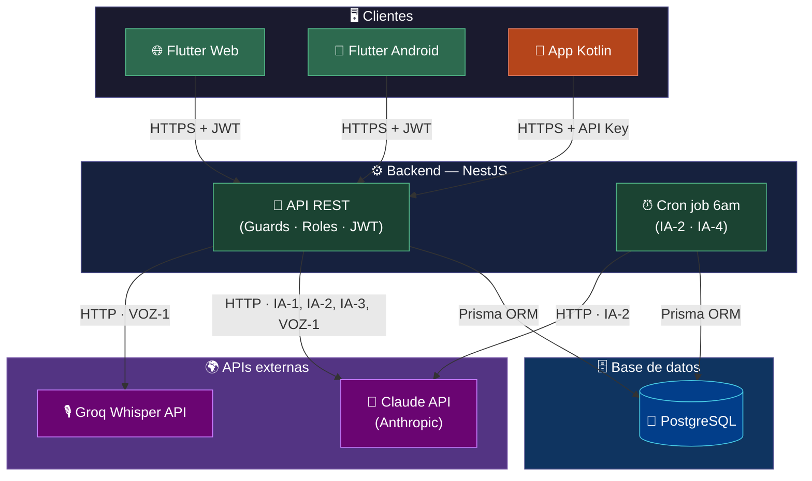
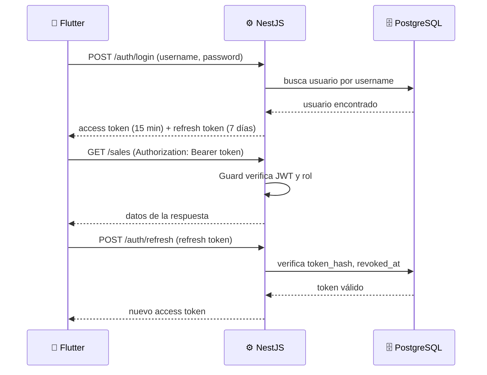
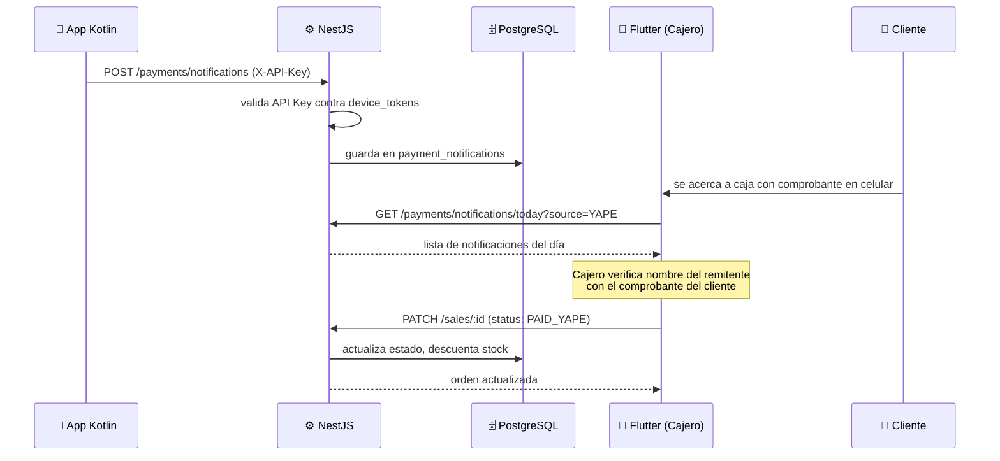
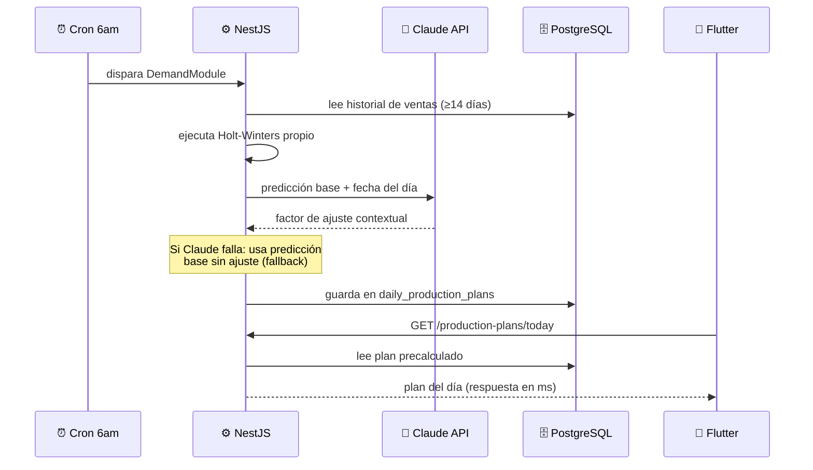
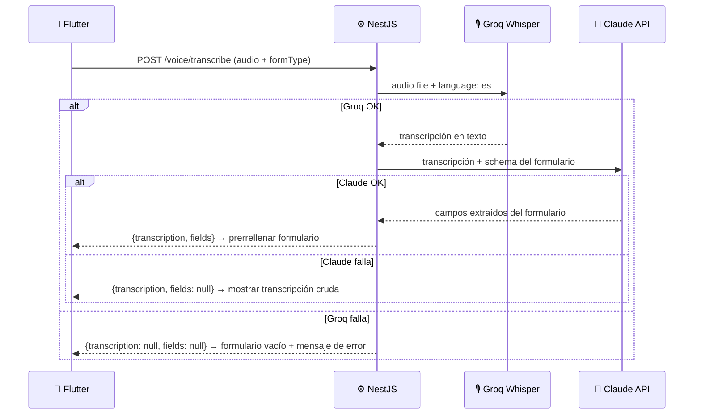

# Arquitectura del sistema

SmartBite es una aplicación multiplataforma con backend en NestJS, frontend
en Flutter y una app Android nativa en Kotlin para la integración de pagos.

---

## Diagrama de arquitectura general



---

## Visión general

El sistema tiene tres capas bien diferenciadas: clientes, backend y datos.
Los clientes Flutter se comunican con el backend via HTTPS con JWT. La app
Kotlin se comunica exclusivamente con el módulo de pagos usando una API Key.
El backend accede a PostgreSQL únicamente a través de Prisma ORM y se
comunica con Claude API y Groq Whisper para las funcionalidades de IA y voz.

---

## Capas del sistema

### Capa de clientes

**Flutter (web y Android)**
Un solo codebase que compila para web y Android. Es la interfaz principal
para todos los roles: dueño, cajero, mozo y cocinero. Se comunica con el
backend via HTTPS REST con JWT en el header `Authorization: Bearer`.

**App Kotlin (Android)**
APK independiente instalada en el celular del negocio. Corre en segundo
plano usando `NotificationListenerService` para interceptar notificaciones
de Yape, Plin y Ágora. Se autentica con el backend usando una API Key en
el header `X-API-Key`. No tiene interfaz propia salvo la pantalla de
registro inicial vía QR. Ver `docs/decisions/0003-kotlin-listener-over-third-party.md`.

---

### Capa de backend (NestJS)

Cada módulo encapsula su controlador, servicio y DTOs. Los Guards de NestJS
protegen cada endpoint verificando el JWT y el rol del usuario.

| Módulo                  | Responsabilidad                                  | Funcionalidades     |
| ----------------------- | ------------------------------------------------ | ------------------- |
| `AuthModule`            | Login, logout, refresh de tokens                 | AUTH-1              |
| `UsersModule`           | Gestión de cuentas y roles                       | AUTH-2              |
| `ProductsModule`        | CRUD de productos y precios                      | OPS-1               |
| `IngredientsModule`     | CRUD de insumos y stock                          | OPS-2               |
| `RecipesModule`         | CRUD de recetas por producto                     | OPS-3               |
| `SalesModule`           | Registro y cobro de órdenes, sale_items incluido | OPS-4, OPS-6, OPS-7 |
| `ExpensesModule`        | Registro de gastos y compras                     | OPS-5               |
| `CashClosesModule`      | Cierre de caja diario inmutable                  | REP-4               |
| `DashboardModule`       | Resumen en tiempo real del día                   | REP-1               |
| `ReportsModule`         | Reportes por período y rentabilidad              | REP-2, REP-3        |
| `AIModule`              | Asistente conversacional Text-to-SQL             | IA-1                |
| `DemandModule`          | Holt-Winters + ajuste Claude API                 | IA-2                |
| `MRPModule`             | Motor de recomendación de compras                | IA-3                |
| `ProductionPlansModule` | Plan diario + cron job 6 a.m.                    | IA-4                |
| `VoiceModule`           | Transcripción Whisper + extracción Claude        | VOZ-1               |
| `PaymentsModule`        | Recepción de notificaciones del listener         | PAG-1               |
| `DevicesModule`         | Registro y revocación de dispositivos Kotlin     | PAG-1               |
| `PrismaModule`          | Acceso a base de datos (transversal)             | —                   |

---

### Capa de base de datos

PostgreSQL accedido exclusivamente a través de Prisma ORM. El schema
completo está en `prisma/schema.prisma`. Ver `docs/database-schema.md`.

---

### APIs externas

**Claude API (Anthropic)**

| Módulo         | Uso                                     | Timeout |
| -------------- | --------------------------------------- | ------- |
| `AIModule`     | Genera SQL a partir de lenguaje natural | 10 s    |
| `DemandModule` | Ajuste contextual de la predicción      | 30 s    |
| `MRPModule`    | Narración de la lista de compras        | 30 s    |
| `VoiceModule`  | Extracción de entidades del formulario  | 10 s    |

Modelo recomendado en producción: `claude-haiku-4-5`. Costo estimado: ~$1.50/mes por local.
Ver `docs/integrations/claude-api.md` y `docs/decisions/0007-claude-fallback-strategy.md`.

**Groq Whisper API**
Usada exclusivamente en `VoiceModule` para transcripción de audio a texto
en español peruano. Modelo: `whisper-large-v3-turbo`. Costo: <$0.03/mes.
Ver `docs/integrations/groq-whisper.md`.

---

## Flujos principales

### Autenticación



### Pago digital



### Plan de producción



### Registro por voz (VOZ-1)



---

## Estructura de carpetas del backend

```
src/
├── app.module.ts
├── main.ts
│
├── auth/
├── users/
├── products/
├── ingredients/
├── recipes/
├── sales/
├── expenses/
├── cash-closes/
├── dashboard/
├── reports/
├── ai/
│   └── prompts/
├── demand/
├── mrp/
│   └── prompts/
├── production-plans/
├── voice/
│   └── prompts/
├── payments/
├── devices/
├── common/
│   ├── guards/
│   ├── decorators/
│   ├── interceptors/
│   └── pipes/
└── prisma/
```

---

## Decisiones arquitectónicas relevantes

| Decisión                          | Documento                                            |
| --------------------------------- | ---------------------------------------------------- |
| Por qué Prisma sobre TypeORM      | `decisions/0001-prisma-over-typeorm.md`              |
| Por qué JWT con refresh tokens    | `decisions/0002-jwt-with-refresh-tokens.md`          |
| Por qué app Kotlin propia         | `decisions/0003-kotlin-listener-over-third-party.md` |
| Por qué API Key para Kotlin       | `decisions/0004-api-key-auth-for-kotlin.md`          |
| Inmutabilidad del cierre de caja  | `decisions/0005-cash-close-immutability.md`          |
| Holt-Winters implementado propio  | `decisions/0006-holt-winters-own-implementation.md`  |
| Estrategia de fallback Claude API | `decisions/0007-claude-fallback-strategy.md`         |
| Plan de producción precalculado   | `decisions/0008-precalculated-production-plan.md`    |

# Caché, vistas SQL e inicialización de base de datos

Este documento complementa `architecture.md` con los detalles de caché
en memoria, vistas SQL y la estrategia de inicialización automática via Docker.

---

## Caché en memoria

Se usa `@nestjs/cache-manager` con store en memoria. Sin Redis — no se
justifica la infraestructura adicional para una instancia única.

### Qué se cachea

| Clave             | Módulo      | TTL        | Se invalida cuando          |
| ----------------- | ----------- | ---------- | --------------------------- |
| `db_schema`       | IA-1, VOZ-1 | Indefinido | Reinicio del servidor       |
| `active_products` | OPS-4       | 5 minutos  | Dueño actualiza un producto |
| `wallet_patterns` | PAG-1       | Indefinido | Reinicio del servidor       |

### Prompt caching de Anthropic

El system prompt con el schema de la BD que se envía a Claude en cada
llamada de IA-1 y VOZ-1 se marca con `cache_control`. Anthropic reutiliza
esos tokens al 10% del precio normal. Reduce el costo de Claude API hasta
un 90% en los tokens de input repetidos.

No requiere implementación en el servidor — se activa con un parámetro
en la llamada al SDK de Anthropic.

Ver `decisions/0011-cache-strategy.md`.

---

## Vistas SQL

Dos vistas PostgreSQL para las consultas de alto costo de reportes:

### `v_daily_summary` — REP-1 Dashboard
Agrega los totales del día actual (ingresos por método de pago, órdenes
abiertas, órdenes pagadas) sin recalcular JOINs en cada request del dashboard.

### `v_product_profitability` — REP-3 Rentabilidad
Calcula el margen unitario de cada producto activo cruzando precio de venta,
recetas e insumos. Sin esta vista, REP-3 requiere un JOIN de cuatro tablas
en cada consulta.

Las vistas se declaran en `schema.prisma` como `view` para obtener tipado
en Prisma. Son de solo lectura.

Ver `decisions/0012-sql-views.md`.

---

## Inicialización automática de la base de datos

Los elementos que Prisma no puede gestionar (vistas, permisos, índices
parciales) se crean automáticamente via Docker al levantar el entorno.

### Estructura

```
prisma/
└── sql/
    ├── 01_views.sql     ← v_daily_summary, v_product_profitability
    ├── 02_roles.sql     ← REVOKE UPDATE/DELETE sobre cash_closes
    └── 03_indexes.sql   ← índices parciales para OPS-7 y órdenes OPEN
```

### Cómo funciona

Docker ejecuta automáticamente cualquier `.sql` en
`/docker-entrypoint-initdb.d/` al crear el contenedor por primera vez.
Los scripts corren en orden alfabético. Todos son idempotentes
(`CREATE OR REPLACE VIEW`, `CREATE INDEX IF NOT EXISTS`).

```yaml
# docker-compose.yml (fragmento relevante)
postgres:
  image: postgres:16
  volumes:
    - postgres_data:/var/lib/postgresql/data
    - ./prisma/sql:/docker-entrypoint-initdb.d  # ← init automático
```

### Flujo de trabajo

| Situación                | Acción                                                                   |
| ------------------------ | ------------------------------------------------------------------------ |
| Primera vez / onboarding | `pnpm dev` — Docker ejecuta los scripts automáticamente                  |
| Modificar una vista      | Editar `prisma/sql/01_views.sql` → `pnpm clean` → `pnpm dev:build`       |
| Agregar un índice        | Editar `prisma/sql/03_indexes.sql` → `pnpm clean` → `pnpm dev:build`     |
| Reset normal de BD       | `pnpm db:reset` — Prisma resetea, Docker ya ejecutó los scripts al crear |

Ver `decisions/0010-docker-sql-init.md`.

---

## Por qué PostgreSQL

Resumen de la justificación técnica:

- **ACID:** el descuento de stock y el cambio de estado de la orden deben ser atómicos. Si falla a la mitad, no puede quedar la orden pagada con stock sin descontar.
- **Permisos de tabla:** `REVOKE UPDATE, DELETE ON cash_closes` garantiza la inmutabilidad del cierre a nivel de BD, independientemente de la API.
- **Vistas nativas:** disponibles sin extensiones ni configuración adicional.
- **`TIMESTAMPTZ`:** zona horaria correcta sin configuración adicional.
- **`gen_random_uuid()`:** PKs UUID sin dependencias externas.
- **Estándar en Railway:** plataforma de despliegue elegida para la demo.

Ver `decisions/0009-postgresql-over-alternatives.md`.