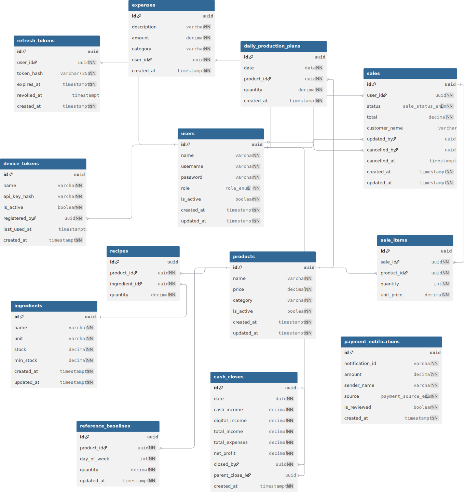

# Esquema de base de datos

SmartBite usa PostgreSQL con Prisma ORM. Todas las tablas usan UUID como
clave primaria y timestamps `created_at` / `updated_at` gestionados por Prisma.

---

## Diagrama ER

---

## Convenciones generales

- Todas las PKs son UUID v4 generados por la base de datos.
- Todos los timestamps usan `TIMESTAMPTZ` (con zona horaria).
- Los campos `created_at` tienen `DEFAULT NOW()`.
- Los campos `updated_at` se actualizan automáticamente vía Prisma.
- Las contraseñas y API Keys nunca se guardan en texto plano, siempre como hash bcrypt.
- Los índices, constraints y ON DELETE rules completos viven en `prisma/schema.prisma`. Este documento describe la intención de diseño; Prisma es la fuente de verdad técnica.

---

## Tablas

### users
Almacena las cuentas de todos los usuarios del sistema. El dueño crea las
cuentas de sus empleados directamente; no existe registro público.

| Columna    | Tipo        | Constraints                   | Descripción                                    |
| ---------- | ----------- | ----------------------------- | ---------------------------------------------- |
| id         | UUID        | PK, DEFAULT gen_random_uuid() | Identificador único                            |
| name       | VARCHAR     | NOT NULL                      | Nombre completo del empleado                   |
| username   | VARCHAR     | NOT NULL, UNIQUE              | Nombre de usuario para iniciar sesión          |
| password   | VARCHAR     | NOT NULL                      | Hash bcrypt de la contraseña                   |
| role       | role_enum   | NOT NULL                      | `OWNER`, `CASHIER`, `WAITER`, `COOK`           |
| is_active  | BOOLEAN     | NOT NULL, DEFAULT true        | Permite deshabilitar una cuenta sin eliminarla |
| created_at | TIMESTAMPTZ | NOT NULL, DEFAULT NOW()       | Fecha de creación                              |
| updated_at | TIMESTAMPTZ | NOT NULL                      | Última modificación                            |

**Índices:**
- `idx_users_username` → UNIQUE sobre `username`. Búsqueda por login.
- `idx_users_role` → sobre `role`. Filtrado por rol en los Guards de NestJS.

---

### refresh_tokens
Un usuario puede tener múltiples sesiones activas simultáneas. Los tokens
se revocan con `revoked_at` en lugar de eliminarse físicamente para mantener
trazabilidad de sesiones comprometidas o cierres de sesión.

| Columna    | Tipo         | Constraints                   | Descripción                                    |
| ---------- | ------------ | ----------------------------- | ---------------------------------------------- |
| id         | UUID         | PK, DEFAULT gen_random_uuid() | Identificador único                            |
| user_id    | UUID         | NOT NULL, FK → users(id)      | Usuario al que pertenece                       |
| token_hash | VARCHAR(255) | NOT NULL, UNIQUE              | SHA-256 hash del token. Nunca texto plano      |
| expires_at | TIMESTAMPTZ  | NOT NULL                      | Fecha de expiración (7 días desde la creación) |
| revoked_at | TIMESTAMPTZ  | NULL                          | Fecha de revocación (logout o compromiso)      |
| created_at | TIMESTAMPTZ  | NOT NULL, DEFAULT NOW()       | Fecha de emisión                               |

**Índices:**
- `idx_refresh_tokens_token_hash` → UNIQUE sobre `token_hash`. Validación del token en cada request.
- `idx_refresh_tokens_user_id` → sobre `user_id`. Listar sesiones activas de un usuario.

**ON DELETE:** `user_id` → CASCADE. Si se elimina el usuario, se eliminan todos sus tokens.

---

### products
Carta de productos del negocio. Solo el dueño puede crear o modificar precios.

| Columna    | Tipo        | Constraints                   | Descripción                                         |
| ---------- | ----------- | ----------------------------- | --------------------------------------------------- |
| id         | UUID        | PK, DEFAULT gen_random_uuid() | Identificador único                                 |
| name       | VARCHAR     | NOT NULL                      | Nombre del producto                                 |
| price      | DECIMAL     | NOT NULL, CHECK (price > 0)   | Precio de venta en soles                            |
| category   | VARCHAR     | NOT NULL                      | Categoría (ej: hamburguesas, bebidas)               |
| is_active  | BOOLEAN     | NOT NULL, DEFAULT true        | Permite quitar un producto de la carta sin borrarlo |
| created_at | TIMESTAMPTZ | NOT NULL, DEFAULT NOW()       | Fecha de creación                                   |
| updated_at | TIMESTAMPTZ | NOT NULL                      | Última modificación                                 |

**Índices:**
- `idx_products_is_active` → sobre `is_active`. Filtrar solo productos activos en la carta.
- `idx_products_category` → sobre `category`. Filtrado por categoría en el menú.

---

### ingredients
Insumos del negocio con control de stock.

| Columna       | Tipo        | Constraints                      | Descripción                                                                                              |
| ------------- | ----------- | -------------------------------- | -------------------------------------------------------------------------------------------------------- |
| id            | UUID        | PK, DEFAULT gen_random_uuid()    | Identificador único                                                                                      |
| name          | VARCHAR     | NOT NULL                         | Nombre del insumo                                                                                        |
| unit          | VARCHAR     | NOT NULL                         | Unidad de medida (kg, unidades, litros)                                                                  |
| stock         | DECIMAL     | NOT NULL, DEFAULT 0, CHECK (≥ 0) | Stock actual                                                                                             |
| min_stock     | DECIMAL     | NOT NULL, DEFAULT 0, CHECK (≥ 0) | Umbral mínimo para activar la alerta OPS-7                                                               |
| cost_per_unit | DECIMAL     | NOT NULL, CHECK (> 0)            | Costo unitario en soles. Requerido para calcular márgenes en REP-3 y la vista `v_product_profitability`. |
| created_at    | TIMESTAMPTZ | NOT NULL, DEFAULT NOW()          | Fecha de creación                                                                                        |
| updated_at    | TIMESTAMPTZ | NOT NULL                         | Última modificación                                                                                      |

> **`is_low_stock`** NO es una columna de la BD. Es un campo calculado (`stock <= min_stock`)
> que el `IngredientsService` agrega a la respuesta de la API. No se persiste en PostgreSQL.

**Índices:**
- `idx_ingredients_stock` → sobre `stock`. Consultas de alertas de stock bajo (OPS-7).

---

### recipes
Relación entre productos e insumos. Define cuánto de cada insumo consume
una unidad del producto. Sin recetas no funcionan OPS-2, IA-3 ni REP-3.

| Columna       | Tipo    | Constraints                    | Descripción                                |
| ------------- | ------- | ------------------------------ | ------------------------------------------ |
| id            | UUID    | PK, DEFAULT gen_random_uuid()  | Identificador único                        |
| product_id    | UUID    | NOT NULL, FK → products(id)    | Producto al que pertenece la receta        |
| ingredient_id | UUID    | NOT NULL, FK → ingredients(id) | Insumo requerido                           |
| quantity      | DECIMAL | NOT NULL, CHECK (quantity > 0) | Cantidad del insumo por unidad de producto |

**Constraints:**
- `uq_recipes_product_ingredient` → UNIQUE sobre `(product_id, ingredient_id)`.

**Índices:**
- `idx_recipes_product_id` → sobre `product_id`. Obtener la receta completa de un producto.

**ON DELETE:**
- `product_id` → CASCADE. Si se elimina el producto, se elimina su receta.
- `ingredient_id` → RESTRICT. No se puede eliminar un insumo que esté en una receta activa.

---

### sales
Registro de cada orden. Nace con estado `OPEN` cuando el mozo o cajero
la registra. El stock se descuenta únicamente al confirmar el cobro (`PAID_*`).
El `id` funciona como número de ticket del cliente.

| Columna       | Tipo             | Constraints                   | Descripción                                                                                                                                                                                                             |
| ------------- | ---------------- | ----------------------------- | ----------------------------------------------------------------------------------------------------------------------------------------------------------------------------------------------------------------------- |
| id            | UUID             | PK, DEFAULT gen_random_uuid() | Identificador único. Es el número de ticket del cliente                                                                                                                                                                 |
| user_id       | UUID             | NOT NULL, FK → users(id)      | Empleado que registró la orden (mozo o cajero)                                                                                                                                                                          |
| status        | sale_status_enum | NOT NULL, DEFAULT 'OPEN'      | `OPEN`, `PAID_CASH`, `PAID_YAPE`, `PAID_PLIN`, `PAID_AGORA`, `CANCELLED`                                                                                                                                                |
| total         | DECIMAL          | NOT NULL, CHECK (total > 0)   | Suma de `sale_items.unit_price * quantity`. Desnormalizado intencionalmente para evitar un JOIN costoso en el dashboard y reportes en tiempo real. Se calcula en `SalesService.create()` y nunca se edita directamente. |
| table_number  | VARCHAR(10)      | NULL                          | Número o identificador de mesa. NULL para pedidos en mostrador o para llevar. Cambiado de INT a VARCHAR para admitir identificadores alfanuméricos (ej: "A3", "Terraza-2").                                             |
| customer_name | VARCHAR          | NULL                          | Nombre del cliente. Opcional, solo si el mozo lo registra                                                                                                                                                               |
| updated_by    | UUID             | NULL, FK → users(id)          | Usuario que realizó la última corrección (OPS-6)                                                                                                                                                                        |
| cancelled_by  | UUID             | NULL, FK → users(id)          | Usuario que canceló la orden                                                                                                                                                                                            |
| cancelled_at  | TIMESTAMPTZ      | NULL                          | Fecha y hora de la cancelación                                                                                                                                                                                          |
| created_at    | TIMESTAMPTZ      | NOT NULL, DEFAULT NOW()       | Fecha y hora de creación de la orden                                                                                                                                                                                    |
| updated_at    | TIMESTAMPTZ      | NOT NULL                      | Última modificación                                                                                                                                                                                                     |

> **`table_number` como VARCHAR:** Permite identificadores como "5", "A3" o "Terraza-2"
> sin necesidad de conversión. NULL para pedidos para llevar o en mostrador sin mesa.
> Se usa para recuperar órdenes cuando el cliente pierde su ticket (el cajero filtra
> por `table_number` + estado `OPEN` en OPS-6).

> **Estados de la orden:**
> - `OPEN` → orden registrada, en preparación o lista para cobrar
> - `PAID_CASH` → cobrada en efectivo, confirmada por el cajero
> - `PAID_YAPE` → cobrada por Yape, confirmada manualmente por el cajero
> - `PAID_PLIN` → cobrada por Plin, confirmada manualmente por el cajero
> - `PAID_AGORA` → cobrada por Ágora, confirmada manualmente por el cajero
> - `CANCELLED` → cancelada antes de cobrar. El stock no se toca nunca en este estado
>   porque el stock solo baja al confirmar el cobro, no al crear la orden.

> **Reglas de cancelación (ADR-0013):**
> Solo se puede cancelar una orden en estado `OPEN`. Las órdenes en estado `PAID_*`
> no pueden cancelarse. Las correcciones post-cobro se hacen vía OPS-6
> (`PATCH /sales/:id`) que registra `updated_by` y `updated_at` pero **no revierte el stock**.
>
> Tabla de transiciones permitidas:
>
> | Estado actual | Transición permitida      | Efecto en stock         | Quién puede                              |
> | ------------- | ------------------------- | ----------------------- | ---------------------------------------- |
> | `OPEN`        | → `PAID_*`                | Descuenta según recetas | `OWNER`, `CASHIER`                       |
> | `OPEN`        | → `CANCELLED`             | Sin efecto              | `OWNER`, `CASHIER`, `WAITER` (solo propias) |
> | `PAID_*`      | Corrección OPS-6          | Sin efecto en stock     | `OWNER` únicamente                       |
> | `PAID_*`      | → `CANCELLED`             | ❌ No permitido (422)   | —                                        |
> | `CANCELLED`   | Cualquier cambio          | ❌ No permitido (422)   | —                                        |

> **Flujo de ticket perdido:**
> El cajero filtra las órdenes por `table_number` y estado `OPEN`. El cliente describe
> qué consumió y el cajero ubica la orden por los productos. Si dos clientes en la misma
> mesa pidieron exactamente lo mismo y ambos perdieron su ticket, el cajero puede cobrar
> cualquiera de las dos órdenes ya que el monto es idéntico.

**Índices:**
- `idx_sales_status` → sobre `status`. Filtrar órdenes abiertas en la pantalla del cajero.
- `idx_sales_table_number` → sobre `table_number`. Filtrar órdenes por mesa en OPS-6.
- `idx_sales_user_id` → sobre `user_id`. Historial de órdenes por empleado (OPS-6).
- `idx_sales_created_at` → sobre `created_at`. Reportes y cierres de caja por fecha.

**ON DELETE:**
- `user_id` → RESTRICT. No se puede eliminar un usuario con ventas registradas.
- `updated_by` → SET NULL. Si se elimina el usuario corrector, se conserva la venta.
- `cancelled_by` → SET NULL. Si se elimina el usuario que canceló, se conserva la orden.

---

### sale_items
Detalle de productos dentro de una orden. Se guarda `unit_price` al momento
de la orden para que un cambio de precio futuro no altere el historial.

| Columna    | Tipo    | Constraints                      | Descripción                            |
| ---------- | ------- | -------------------------------- | -------------------------------------- |
| id         | UUID    | PK, DEFAULT gen_random_uuid()    | Identificador único                    |
| sale_id    | UUID    | NOT NULL, FK → sales(id)         | Orden a la que pertenece               |
| product_id | UUID    | NOT NULL, FK → products(id)      | Producto ordenado                      |
| quantity   | INT     | NOT NULL, CHECK (quantity > 0)   | Cantidad ordenada                      |
| unit_price | DECIMAL | NOT NULL, CHECK (unit_price > 0) | Precio unitario al momento de la orden |

**Índices:**
- `idx_sale_items_sale_id` → sobre `sale_id`. Obtener el detalle completo de una orden.
- `idx_sale_items_product_id` → sobre `product_id`. Reportes de ventas por producto (REP-3).

**ON DELETE:**
- `sale_id` → CASCADE. Si se elimina la orden, se eliminan sus ítems.
- `product_id` → RESTRICT. No se puede eliminar un producto con ventas registradas.

---

### expenses
Gastos operativos del negocio. Base del cálculo de ganancia en REP-4.
Registrar un gasto no actualiza el stock automáticamente — son operaciones
separadas. El gasto es un movimiento financiero; el stock es el inventario físico.

| Columna     | Tipo        | Constraints                   | Descripción                                     |
| ----------- | ----------- | ----------------------------- | ----------------------------------------------- |
| id          | UUID        | PK, DEFAULT gen_random_uuid() | Identificador único                             |
| description | VARCHAR     | NOT NULL                      | Descripción del gasto                           |
| amount      | DECIMAL     | NOT NULL, CHECK (amount > 0)  | Monto en soles                                  |
| category    | VARCHAR     | NOT NULL                      | Categoría (insumos, alquiler, servicios, otros) |
| user_id     | UUID        | NOT NULL, FK → users(id)      | Usuario que registró el gasto                   |
| created_at  | TIMESTAMPTZ | NOT NULL, DEFAULT NOW()       | Fecha del gasto                                 |

**Índices:**
- `idx_expenses_created_at` → sobre `created_at`. Sumar gastos del día en el cierre de caja.
- `idx_expenses_user_id` → sobre `user_id`. Gastos registrados por empleado.

**ON DELETE:**
- `user_id` → RESTRICT. No se puede eliminar un usuario con gastos registrados.

---

### cash_closes
Cierre de caja diario. Registro inmutable: no se permite UPDATE ni DELETE
sobre esta tabla a nivel de API ni de base de datos.

| Columna         | Tipo        | Constraints                   | Descripción                                        |
| --------------- | ----------- | ----------------------------- | -------------------------------------------------- |
| id              | UUID        | PK, DEFAULT gen_random_uuid() | Identificador único                                |
| date            | DATE        | NOT NULL, UNIQUE              | Fecha del cierre. Solo uno por día                 |
| cash_income     | DECIMAL     | NOT NULL, DEFAULT 0           | Suma de todas las órdenes PAID_CASH del día        |
| digital_income  | DECIMAL     | NOT NULL, DEFAULT 0           | Suma de PAID_YAPE + PAID_PLIN + PAID_AGORA del día |
| total_income    | DECIMAL     | NOT NULL                      | cash_income + digital_income ¹                     |
| total_expenses  | DECIMAL     | NOT NULL, DEFAULT 0           | Total de gastos del día                            |
| net_profit      | DECIMAL     | NOT NULL                      | total_income − total_expenses ¹                    |
| closed_by       | UUID        | NOT NULL, FK → users(id)      | Usuario que generó el cierre                       |
| parent_close_id | UUID        | NULL, FK → cash_closes(id)    | Referencia al cierre original si es un ajuste      |
| created_at      | TIMESTAMPTZ | NOT NULL, DEFAULT NOW()       | Fecha y hora de generación                         |

> ¹ **Desnormalización intencional:** `total_income` y `net_profit` violan la 3FN de forma
> deliberada para preservar la integridad del registro histórico inmutable.
> Ver `decisions/0005-cash-close-immutability.md`.

> **Ganancia estimada en REP-1 vs net_profit aquí:** El campo `net_profit` de esta tabla
> es el valor definitivo al momento del cierre, calculado sobre todos los datos del día.
> La "ganancia estimada" del dashboard (REP-1) es un valor en tiempo real calculado por
> el `DashboardService` combinando `v_daily_summary` (ingresos) con una query separada
> a `expenses WHERE created_at::date = CURRENT_DATE` (gastos). Son dos valores distintos:
> uno en tiempo real y uno histórico inmutable.

**Constraints:**
- `uq_cash_closes_date` → UNIQUE sobre `date`. Solo se permite un cierre por día.
- El cierre de ajuste NO tiene restricción UNIQUE sobre `date` porque puede haber
  múltiples ajustes del mismo día. La restricción aplica solo a cierres normales
  (`parent_close_id IS NULL`). Implementar con un índice parcial:
  `CREATE UNIQUE INDEX uq_cash_closes_date_normal ON cash_closes (date) WHERE parent_close_id IS NULL;`

**ON DELETE:**
- `closed_by` → RESTRICT.
- `parent_close_id` → RESTRICT.

---

### payment_notifications
Notificaciones de pago recibidas por el listener Kotlin (PAG-1). Son
puramente informativas: el cajero las consulta como referencia visual para
confirmar pagos digitales de forma manual.

| Columna         | Tipo                | Constraints                   | Descripción                                                                                                      |
| --------------- | ------------------- | ----------------------------- | ---------------------------------------------------------------------------------------------------------------- |
| id              | UUID                | PK, DEFAULT gen_random_uuid() | Identificador único                                                                                              |
| notification_id | VARCHAR             | NOT NULL, UNIQUE              | ID único de la notificación. Garantiza idempotencia                                                              |
| amount          | DECIMAL             | NOT NULL, CHECK (amount > 0)  | Monto recibido                                                                                                   |
| sender_name     | VARCHAR             | NOT NULL                      | Nombre del remitente extraído de la notificación                                                                 |
| source          | payment_source_enum | NOT NULL                      | `YAPE`, `PLIN`, `AGORA`                                                                                          |
| raw_text        | VARCHAR(500)        | NOT NULL                      | Texto completo de la notificación interceptada. Útil para debugging y para re-parsear si el patrón se actualiza. |
| is_reviewed     | BOOLEAN             | NOT NULL, DEFAULT false       | Indica si el cajero ya atendió esta notificación                                                                 |
| reviewed_by     | UUID                | NULL, FK → users(id)          | Usuario que marcó la notificación como revisada                                                                  |
| reviewed_at     | TIMESTAMPTZ         | NULL                          | Fecha y hora en que se marcó como revisada                                                                       |
| created_at      | TIMESTAMPTZ         | NOT NULL, DEFAULT NOW()       | Fecha y hora en que se recibió la notificación                                                                   |

> Esta tabla no tiene FK hacia `sales` de forma intencional. El cajero conecta
> visualmente la notificación con la orden por nombre, monto y número de mesa.
> La relación es operativa (la hace el cajero), no estructural (no la hace la BD).

**Índices:**
- `idx_payment_notifications_notification_id` → UNIQUE. Idempotencia.
- `idx_payment_notifications_is_reviewed` → sobre `is_reviewed`.
- `idx_payment_notifications_created_at` → sobre `created_at`.

**ON DELETE:**
- `reviewed_by` → SET NULL. Si se elimina el usuario, la notificación conserva su estado revisado.

---

### device_tokens
Dispositivos Android autorizados para enviar notificaciones de pago (PAG-1).

| Columna       | Tipo        | Constraints                   | Descripción                                                   |
| ------------- | ----------- | ----------------------------- | ------------------------------------------------------------- |
| id            | UUID        | PK, DEFAULT gen_random_uuid() | Identificador único                                           |
| name          | VARCHAR     | NOT NULL                      | Nombre descriptivo del dispositivo (ej: "Celular caja")       |
| api_key_hash  | VARCHAR     | NOT NULL, UNIQUE              | Hash bcrypt de la API Key. Nunca texto plano                  |
| is_active     | BOOLEAN     | NOT NULL, DEFAULT true        | `false` cuando el dueño revoca el dispositivo                 |
| registered_by | UUID        | NOT NULL, FK → users(id)      | Dueño que registró el dispositivo vía QR                      |
| last_used_at  | TIMESTAMPTZ | NULL                          | Última vez que se usó la clave. Actualizable por el listener. |
| revoked_at    | TIMESTAMPTZ | NULL                          | Fecha y hora de revocación. NULL mientras esté activo.        |
| created_at    | TIMESTAMPTZ | NOT NULL, DEFAULT NOW()       | Fecha de registro                                             |

> **`revoked_at`:** Se setea cuando el dueño pulsa "Revocar dispositivo" en Flutter.
> Junto con `is_active = false`, permite auditar cuándo y por qué se revocó un dispositivo.
> Un dispositivo con `is_active = false` recibe `401` inmediatamente en cualquier POST.

**Índices:**
- `idx_device_tokens_api_key_hash` → UNIQUE. Validación de la API Key en cada POST.
- `idx_device_tokens_is_active` → sobre `is_active`.

**ON DELETE:**
- `registered_by` → RESTRICT.

---

### reference_baselines
Promedios de referencia configurables para cuando IA-2 tiene menos de 14 días
de datos propios. El seeder los pre-puebla con los promedios del primer mes
de datos sintéticos.

| Columna     | Tipo        | Constraints                    | Descripción                                  |
| ----------- | ----------- | ------------------------------ | -------------------------------------------- |
| id          | UUID        | PK, DEFAULT gen_random_uuid()  | Identificador único                          |
| product_id  | UUID        | NOT NULL, FK → products(id)    | Producto al que aplica la referencia         |
| day_of_week | INT         | NOT NULL, CHECK (0 ≤ day ≤ 6)  | Día de la semana (0 = lunes … 6 = domingo)   |
| quantity    | DECIMAL     | NOT NULL, CHECK (quantity > 0) | Cantidad de referencia sugerida para ese día |
| updated_at  | TIMESTAMPTZ | NOT NULL                       | Última vez que se actualizó el valor         |

**Constraints:**
- `uq_reference_baselines_product_day` → UNIQUE sobre `(product_id, day_of_week)`.

**ON DELETE:**
- `product_id` → CASCADE.

---

### daily_production_plans
Plan de producción diario precalculado por el cron job de las 6 a.m.
Todos los clientes leen esta tabla; ningún cliente ejecuta IA en tiempo real.

| Columna           | Tipo        | Constraints                    | Descripción                                                                |
| ----------------- | ----------- | ------------------------------ | -------------------------------------------------------------------------- |
| id                | UUID        | PK, DEFAULT gen_random_uuid()  | Identificador único                                                        |
| date              | DATE        | NOT NULL                       | Fecha del plan                                                             |
| product_id        | UUID        | NOT NULL, FK → products(id)    | Producto                                                                   |
| quantity          | DECIMAL     | NOT NULL, CHECK (quantity > 0) | Unidades sugeridas para producir                                           |
| prediction_source | VARCHAR(50) | NOT NULL                       | `holt_winters_with_adjustment`, `holt_winters_base`, `reference_baselines` |
| created_at        | TIMESTAMPTZ | NOT NULL, DEFAULT NOW()        | Fecha de generación                                                        |

> **`prediction_source`** indica cómo se generó el plan:
> - `holt_winters_with_adjustment` → cron normal, Holt-Winters + ajuste de Claude API.
> - `holt_winters_base` → cron corrió pero Claude API falló; se usó predicción sin ajuste.
> - `reference_baselines` → menos de 14 días de historial; se usaron promedios de referencia.
>
> El cliente Flutter usa este campo para mostrar un aviso si el plan no es el óptimo.

**Constraints:**
- `uq_daily_production_plans_date_product` → UNIQUE sobre `(date, product_id)`.

**Índices:**
- `idx_daily_production_plans_date` → sobre `date`.

**ON DELETE:**
- `product_id` → CASCADE.

---

## Enums

| Enum                  | Valores                                                                  |
| --------------------- | ------------------------------------------------------------------------ |
| `role_enum`           | `OWNER`, `CASHIER`, `WAITER`, `COOK`                                     |
| `sale_status_enum`    | `OPEN`, `PAID_CASH`, `PAID_YAPE`, `PAID_PLIN`, `PAID_AGORA`, `CANCELLED` |
| `payment_source_enum` | `YAPE`, `PLIN`, `AGORA`                                                  |

---

## Relaciones principales

| Tabla origen | Tabla destino          | Tipo  | ON DELETE | Descripción                                     |
| ------------ | ---------------------- | ----- | --------- | ----------------------------------------------- |
| users        | refresh_tokens         | 1 a N | CASCADE   | Un usuario puede tener varias sesiones activas  |
| users        | sales                  | 1 a N | RESTRICT  | Un usuario registra muchas órdenes              |
| users        | expenses               | 1 a N | RESTRICT  | Un usuario registra muchos gastos               |
| users        | cash_closes            | 1 a N | RESTRICT  | Un usuario genera muchos cierres de caja        |
| users        | device_tokens          | 1 a N | RESTRICT  | Un dueño puede registrar varios dispositivos    |
| sales        | sale_items             | 1 a N | CASCADE   | Una orden tiene uno o más ítems                 |
| products     | sale_items             | 1 a N | RESTRICT  | Un producto aparece en muchas órdenes           |
| products     | recipes                | 1 a N | CASCADE   | Un producto tiene una receta con varios insumos |
| ingredients  | recipes                | 1 a N | RESTRICT  | Un insumo aparece en varias recetas             |
| cash_closes  | cash_closes            | 1 a 1 | RESTRICT  | Un cierre de ajuste referencia al original      |
| products     | reference_baselines    | 1 a N | CASCADE   | Un producto tiene referencias por día           |
| products     | daily_production_plans | 1 a N | CASCADE   | Un producto aparece en varios planes diarios    |
| users        | payment_notifications  | 1 a N | SET NULL  | Un cajero puede revisar muchas notificaciones   |
